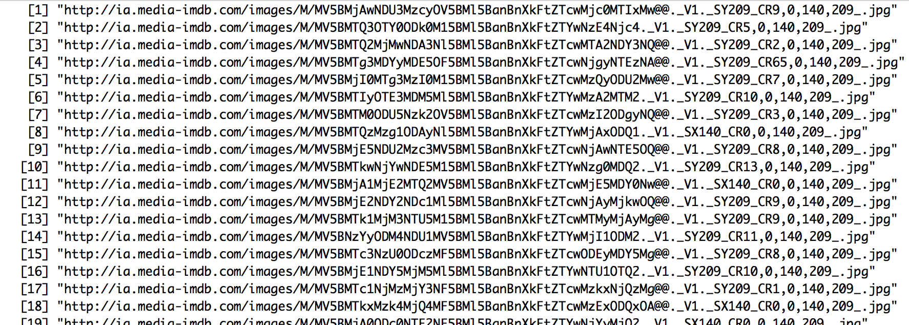
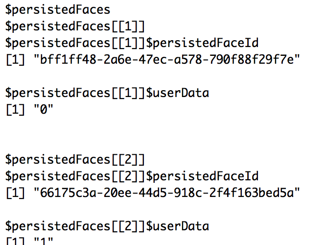

project2
========================================================
author: Shuye Han
date: 
autosize: true

Introduction
========================================================

<p>In this project I will continue the topic of facial detection and recognition</p>
<p>in the first project. This time, however, I will go a little deeper and make </p>
<p>the project more diversified and visualized through Shiny app and Microsoft</p><p> API</p>

Content of the projects
========================================================

- Users can upload their own images onto the page
- System would go through the whole database and find out the most similar faces by different grouping condition
- Give a outlook of the overall distribution of all the features in record and the position of the user face feature
- Multi-dimensional analysis of the features in face database
- Deep 3D ploting of the features of the uploaded picture
- Find the specific face with the brief description the user types in

Steps to build the Shiny project
========================================================

 1.Initiate the image database
 2.Build the shiny layout
 3.Set up the dynamic analysis system and connections with Microsoft API

Website that stores the image data
========================================================

http://www.imdb.com/list/ls058011111/

- List of 1000 actors and actress 
- 100 per page and 10 pages


 
 
Initiate the image database
========================================================

For the characteristics of Microsoft API, we retrieve the urls of online images 
instead of storing them locally.


```r
library(rvest)
linksactresses = 'http://www.imdb.com/list/ls058011111/'
out = read_html(linksactresses)
images = html_nodes(out, '.zero-z-index')
imglinks = html_nodes(out, xpath = "//img[@class='zero-z-index']/@src") %>% html_text()
for (i in c(1:9))
{ 
  infix=paste('?start=',i,'01&view=detail&sort=listorian:asc',sep="")
  linksactresses=paste('http://www.imdb.com/list/ls058011111/',infix,sep="")
  out = read_html(linksactresses)
  images = html_nodes(out, '.zero-z-index')
  templink=html_nodes(out, xpath = "//img[@class='zero-z-index']/@src") %>% html_text()
  imglinks=c(imglinks,templink)
}
```


Image retrieving result
========================================================

```r
imglinks
```


Sending the pictures to Microsoft API
========================================================

Attention that a free API pass would only allow 20 requests within a minute


```r
for (i in imglinks)
{
  if (i %in% finalframe[['link']])
  {
    next
  }
  tempface=getFaceResponseURL(i, facekey)
  if (length(tempface)!=14)
  {
    next
  }
  tempemotion=getEmotionResponseURL(i, emotionkey)
  if (length(tempemotion)!=12)
  {
    next
  }
  tempemotion=data.frame(tempemotion)
  tempface=data.frame(tempface)
  tempface['link']=i
  tempemotion=tempemotion[grep('scores',names(tempemotion))]
  newframe=cbind(tempface,tempemotion)
  finalframe=rbind(finalframe,newframe)
}
```

This is really a very long procedure!!!

Take a look at the dataframe we got
========================================================


```r
names(finalframe)
```


```r
head(finalframe)
```


Save the temporary result
========================================================


```r
saveRDS(finalframe, file="facefeature.rds")
```

Create face list
========================================================


```r
library(dplyr)
facelist_male = "https://api.projectoxford.ai/face/v1.0/facelists/list_gender_male"
facelist_female= "https://api.projectoxford.ai/face/v1.0/facelists/list_gender_female"
facelist_hair_y="https://api.projectoxford.ai/face/v1.0/facelists/list_hair_y"
facelist_hair_n="https://api.projectoxford.ai/face/v1.0/facelists/list_hair_n"
facelist_age_2="https://api.projectoxford.ai/face/v1.0/facelists/list_age_2"
facelist_age_3="https://api.projectoxford.ai/face/v1.0/facelists/list_age_3"
facelist_age_4="https://api.projectoxford.ai/face/v1.0/facelists/list_age_4"
facelist_list=c(facelist_male,facelist_female,facelist_hair_y,facelist_hair_n,facelist_age_2,facelist_age_3,facelist_age_4)
for (i in facelist_list)
{
  mybody=list(name=i)
  faceLIST = PUT(
    url = i,
    content_type('application/json'), add_headers(.headers = c('Ocp-Apim-Subscription-Key' = facekey)),
    body = mybody,
    encode = 'json'
  )
  print(content(faceLIST))
}
```

Face list
========================================================


```r
 print(faceLIST)
```


Add the images into corresponding facelist(1)
========================================================


```r
facelist_image_male=unique(select(filter(finalframe,faceAttributes.gender=='male'),link))[[1]]
facelist_image_female=unique(select(filter(finalframe,faceAttributes.gender=='female'),link))[[1]]
facelist_image_hair_y=unique(select(filter(finalframe,faceAttributes.facialHair.beard==0),link))[[1]]
facelist_image_hair_n=unique(select(filter(finalframe,faceAttributes.facialHair.beard!=0),link))[[1]]
finalframe['faceAttributes.age']=as.numeric(as.vector(finalframe[['faceAttributes.age']]))
facelist_age_2=unique(select(filter(finalframe,(faceAttributes.age>=20) & (faceAttributes.age<30)),link))[[1]]
facelist_age_3=unique(select(filter(finalframe,(faceAttributes.age>=30) & (faceAttributes.age<40)),link))[[1]]
facelist_age_4=unique(select(filter(finalframe,(faceAttributes.age>=40)),link))[[1]]
```


Add the images into corresponding facelist(2)
========================================================


```r
image_list=list(facelist_image_male,facelist_image_female,facelist_image_hair_y,facelist_image_hair_n,facelist_age_2,facelist_age_3,facelist_age_4)
for (i in c(1:length(facelist_list)))
{
  URL.face = facelist_list[i]
  userdata=0
  for (j in image_list[[i]])
  {
    face.uri = paste(
      URL.face,'/persistedFaces?userData=',
      userdata,
      sep = ""
    )
    face.uri = URLencode(face.uri)
    mybody = list(url = j )
    faceLISTadd = POST(
      url = face.uri,
      content_type('application/json'), add_headers(.headers = c('Ocp-Apim-Subscription-Key' = facekey)),
      body = mybody,
      encode = 'json'
    )
    userdata=userdata+1
  }
}
```

Add the images into corresponding facelist(3)
========================================================


```r
content=GET(url='https://api.projectoxford.ai/face/v1.0/facelists/list_age_2',content_type('application/json'),       
    add_headers(.headers = c('Ocp-Apim-Subscription-Key' = facekey)))
```





